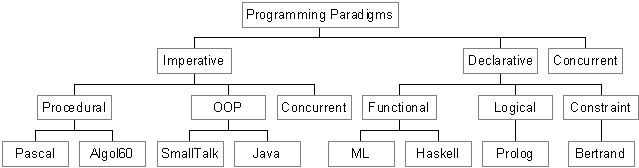

# Paradigm

    A Paradigm is a style of programming

    paradigm(noun)
    a typical example or pattern of something; a pattern or model.

## Programming Paradigms

1. Imperative
2. Logical
3. Object Oriented
4. Functional

## Imperative

    Follow the commands; Do this, then do that

## Declarative

    I would need this. I leave it to you on how to do it

## Objected Oriented

    Most of the developers, at some point would have heard about Object Oriented Programming. 
    The idea of object oriented style is to mimic real world objects and exchange data in the form of messages

[Next](../01-functional-programming/README.md)
